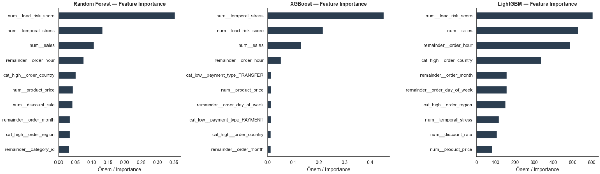
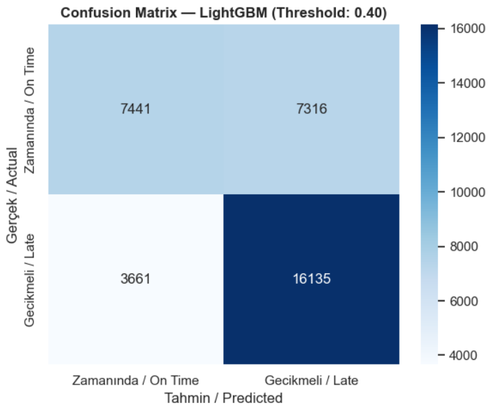
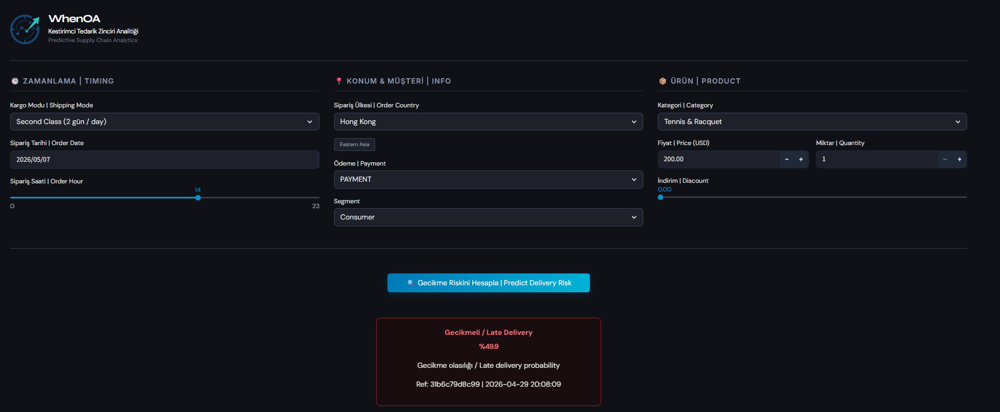
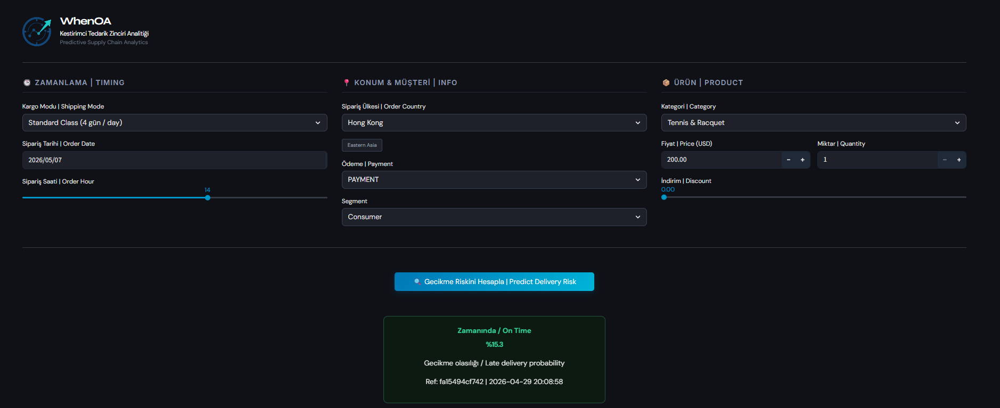

# WhenOA | Predictive Supply Chain Analytics

[Türkçe okumak için tıklayın (Click to read in Turkish)](readme.tr.md)

### A machine learning model that predicts delivery delays at the moment an order is placed.

## 🧭 Problem

Logistics companies learn about delivery delays after they happen. But when an order enters the system, key information such as shipping mode, product type, order hour, region is already available. Can we use this information to predict delays **before** they occur?

**The question this project answers:** Given only the information available at the moment an order is placed, will that order be delivered late?

This question is the logistics equivalent of "will this loan be repaid?" in finance, "will this machine break down?" in manufacturing, or "will this user churn?" in e-commerce. Same structure: predicting a future event using variables known in the past.

---

## ⚠️ Why Very High Scores Are Suspicious

They're not realistic. The dataset contains columns like `days_for_shipping_real`, `delivery_status`, and `order_status` information that only exists **after** a delivery is completed. Including these in a model is equivalent to giving students the answers before the exam. The model doesn't learn anything, it just memorizes.

This is called **data leakage**. Once deployed, this information won't be available. The model fails in production.

Four leakage decisions were made in this project:

| Column | Why removed |
|---|---|
| `days_for_shipping_real` | Only known after delivery completes |
| `delivery_status` | Contains post-delivery information |
| `late_delivery_risk` | Is the target variable itself |
| `order_status` | Seeing `COMPLETE` or `CLOSED` requires the order to have closed, unavailable at prediction time |

After removing leakage, AUC dropped to **0.796**. A lower number, but a **trustworthy** one.

---

## 📦 Dataset

**DataCo Smart Supply Chain:** 180,519 order records, 53 features.  
Source: Fabian Constante et al., Mendeley Data, 2019.

Covers 2015–2018, 5 markets (LATAM, Europe, Pacific Asia, USCA, Africa), 23 regions, 51 product categories, 4 shipping modes.

---

## 🧹 Data Cleaning | Decisions Made

Every cleaning step was justified, not "ran and moved on."

- **Redundant columns**: 6 column pairs were proven identical using the `==` operator and removed

```python
pairs = [
    ('order_item_cardprod_id', 'product_card_id'),
    ('order_profit_per_order', 'benefit_per_order'),
    # ...
]
for col1, col2 in pairs:
    print(f"{col1} == {col2} → {(df[col1] == df[col2]).all()}")
# All → True
```

- **PII & uninformative columns:** `customer_password`, `customer_email`, `customer_street` removed for privacy: `product_status` removed because all values were 0, zero information content.

- **Category inconsistency:** The `Electronics` category was mapped to two different `category_id` values - one containing footwear, the other golf balls. Detected via `groupby('category_name')['category_id'].nunique() > 1` and corrected by renaming each ID to its actual content.

- **Location anomaly:** 3 rows where `customer_state` contained zip codes (95758, 91732) instead of state abbreviations were detected and removed.

- **Canceled orders:** 7,754 orders with `delivery_status == 'Shipping canceled'` were excluded. Rationale: predicting whether a canceled order would have been late is meaningless. The model operates only on deliverable orders (180,516 → 172,762 rows).

---

## 🔍 Exploratory Analysis | Key Findings

- **Late delivery is a structural problem.** The monthly late delivery rate stays flat between 54–57% all year with no seasonality or improvement trend. The issue is systemic, not seasonal.

- **Shipping mode is the strongest signal.** First Class shows over 95% late delivery rate. Standard Class drops to 38%. First Class likely makes short-window commitments that the logistics infrastructure cannot fulfill.

- **Risk rises dramatically as planned delivery time shrinks.** 1-day planned delivery → 95% late rate: 4-day planned → 38%. Strong relationship, but dangerous to use directly, feature engineering was required.

**Correlation analysis confirmed leakage signals:**

```
real_days       →  +0.40  (strong positive - LEAKAGE)
scheduled_days  →  -0.37  (strong negative - handle with care)
order_hour      →  +0.047 (weak but meaningful)
```

---

## ⚙️ Feature Engineering | Breaking the Dictatorship

In the first training attempt, `scheduled_days` captured 80% of feature importance. The model was essentially a one-variable rule. This meant both overfitting risk and poor generalization.

Solution: instead of feeding `scheduled_days` directly to the model, embed its information into two hybrid features that combine it with other variables.

```python
time_factor = 4 / (df['scheduled_days'] + 1)

# Short window + expensive + high volume → high risk
df['load_risk_score'] = (df['product_price'] * df['item_quantity']) * time_factor

# Evening order + short window → high stress
df['temporal_stress'] = (df['order_hour'] > 17).astype(int) * time_factor

# Drop the dominant column
X = df.drop(columns=['late_delivery', 'scheduled_days'])
```

Why 4 as the constant: `scheduled_days` maxes at 4, so the denominator ranges from 1–5, keeping the scale between 0–4, comparable in magnitude to other numerical features.

Result: no single column dominates. `load_risk_score`, `sales`, `order_hour`, and `order_country` all contribute meaningfully.

---

## 🤖 Model Selection

Four models were compared:

| Model | Test Acc | Train-Test Gap | AUC |
|---|---|---|---|
| Logistic Regression | 59.9% | 0.33% | 0.666 |
| Random Forest | 72.4% | 3.22% | 0.800 |
| XGBoost | 72.5% | 2.23% | 0.801 |
| **LightGBM** | **72.5%** | **0.26%** | **0.796** |

**LightGBM was selected.** The AUC difference from XGBoost is only 0.005 and statistically negligible. But LightGBM's train-test gap is just 0.26%, meaning the model behaves consistently across different data splits.

**Why AUC matters:** Accuracy alone is misleading. If 57% of orders are late, a model that predicts "always late" gets 57% accuracy. AUC measures how well the model separates the two classes regardless of class imbalance.

**5-Fold Cross-Validation:**

```
CV AUC Scores : [0.789, 0.793, 0.793, 0.795, 0.795]
Mean          : 0.7931 ± 0.0021
```

Standard deviation of 0.002, consistent performance regardless of which data split the model sees. Not luck.

**What is the realistic ceiling for this dataset?** For leakage-free tabular ML models, AUC ~0.82–0.85. The achieved 0.796 sits at approximately 90% of that ceiling. Closing the remaining gap would require unmeasured variables: weather, carrier capacity, warehouse fill rate.



---

## 🎯 Threshold | A Business Decision

With the default threshold of 0.50, Recall was 0.60 that means 40% of late deliveries were being missed.

**The business question:** Is missing a late delivery more costly than generating a false alarm?

In logistics, the answer is clear: a missed late delivery leads to customer loss, penalty fees, and reputational damage. A false alarm is an operational inconvenience. **Recall was prioritized** and threshold was lowered to 0.40.

| Threshold | Recall(1) | Precision(1) | Accuracy |
|---|---|---|---|
| 0.50 | 0.60 | 0.89 | 72.5% |
| **0.40** | **0.82** | **0.69** | **68.0%** |

Trading 4.5% accuracy to raise late delivery detection from 60% to 82%.



---

## 📊 Final Results

```
Model           : LightGBM | Threshold: 0.40
Test Accuracy   : 72.5% (threshold 0.50)
AUC-ROC         : 0.7963
CV AUC (5-Fold) : 0.7931 ± 0.0021
Recall (Late)   : 0.82
Train-Test Gap  : 0.26%
```

---

## 🔬 Model Validation | Consistency Tests

After deployment, the model was tested systematically. Shipping mode, quantity, and hour-based tests aligned with EDA findings:

- **Shipping mode:** Same Day and First Class at 99%+ late, consistent with 95%+ in EDA ✅
- **Quantity (1→5):** Monotonic and smooth increase in late delivery probability, no jumps ✅
- **Hour & discount:** Balanced distribution, consistent across all ranges ✅

**Identified limitation | Price:** The model produces consistent and intuitive results in the $0–450 range. Reliability decreases above $500.

```
Price range    | Training samples          | Model behavior
---------------|---------------------------|----------------
$0 – $450      | 179,544  (99.5%)          | Consistent ✅
$500 – $1,000  | 515      (0.3%)           | Use with caution ⚠️
$1,000 – $2,000| 457      (0.25%)          | Unreliable ❌
```

This is a fundamental property of all ML models: a model cannot make reliable predictions outside the distribution it was trained on. What matters is testing, measuring, and documenting this boundary.

---

## 🚀 Live Demo

**[whenoa.com](https://whenoa.com)** | Enter order details to get an instant delivery risk prediction.

| Late Delivery | On Time |
|---|---|
|  |  |

---

## 🗂️ Project Structure

```
supply-chain-predictive-analytics/
│
├── README.md
├── readme.tr.md
├── requirements.txt
├── .gitignore
│
├── 01_data/
│   ├── 01_raw_data/          # Raw data not pushed (see .gitignore)
│   └── 02_processed_data/    # Processed data not pushed (see .gitignore)
│
├── 02_notebooks/
│   ├── 01_eda_and_cleaning.ipynb
│   └── 02_modeling_and_evaluation.ipynb
│
├── 03_app/
│   ├── app.py
│   ├── logic.py
│   ├── constants.py
│   └── style.css
│
├── 04_models/
│   └── lightgbm_late_delivery.pkl
│
└── assets/
    ├── demo_late.png
    ├── demo_ontime.png
    ├── feature_importance.png
    └── confusion_matrix.png
```